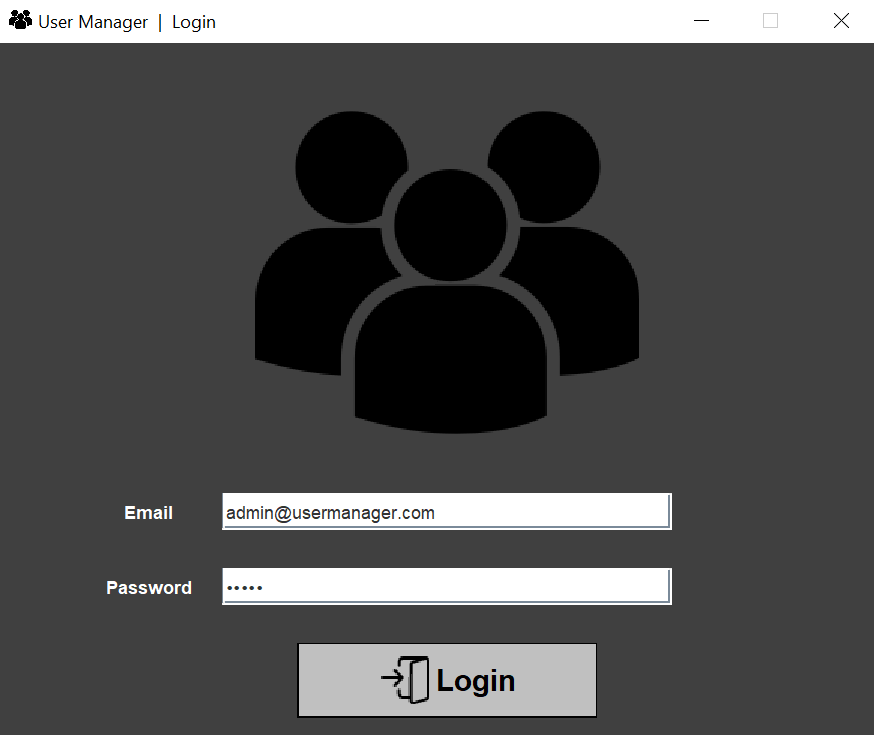
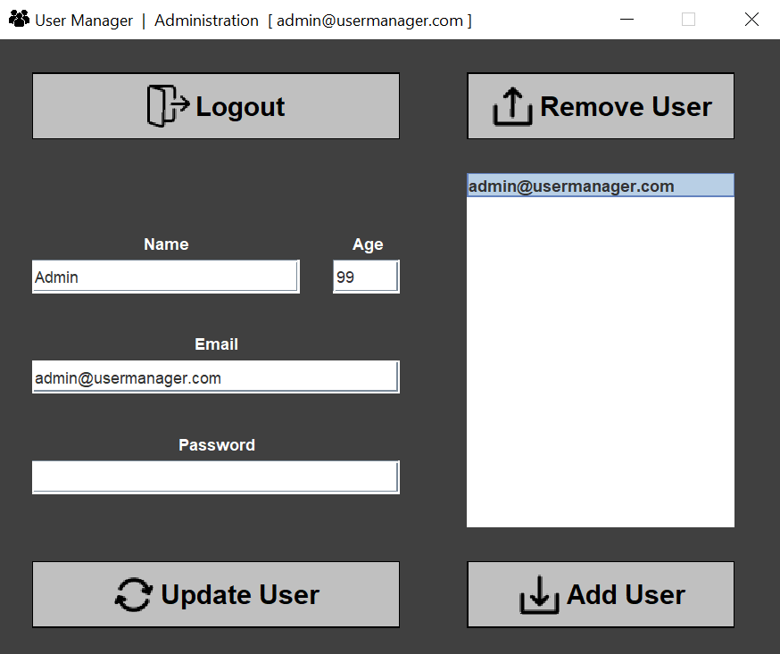

# UserManager
**UserManager** is a demo project for testing various Swing/AWT objects and SQLite in Java.

---

## Features
- login with user
- add/delete/update user
- basic privilege system (users can update themselves ; admin can update/add/remove all users)
- user database handling via SQLite
- encryption of user passwords via BCrypt
- input checks with regular expressions

### Preinstalled dependencies
- [SQLite JDBC (3.36.0.3)](https://mvnrepository.com/artifact/org.xerial/sqlite-jdbc)
- [BCrypt (0.9.0)](https://mvnrepository.com/artifact/at.favre.lib/bcrypt)
- [Bytes (1.3.0)](https://mvnrepository.com/artifact/org.apache.tuweni/bytes) (dependency of BCrypt)
- [ConsoleLogger](https://github.com/TillSim/HelperClass-ConsoleLogger)
- [Filehandler](https://github.com/TillSim/HelperClass-FileHandler)
